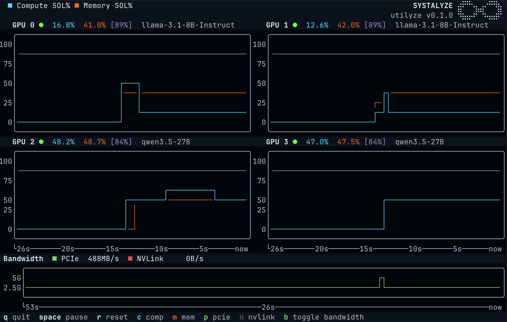

# Utilyze

Utilyze measures how efficiently your GPU is doing useful work, not just whether it's busy. It runs live against your workload with negligible overhead.



Standard tools like `nvidia-smi` and `nvtop` only check whether a kernel is running on the GPU. They can show 100% while your workload is using a tiny fraction of the hardware's real capacity. 

Utilyze reads GPU performance counters directly to show what's actually being used, and provides an estimate of how far you can push utilization given a workload, model, and hardware. To learn more, read [our blog post](https://systalyze.com/utilyze).

Utilyze is created by [Systalyze](https://systalyze.com).

## Requirements

- Linux amd64 (arm64 support coming soon)
- NVIDIA Ampere or newer GPU (A100, H100, H200, B200, RTX 3000+)
- CUDA Toolkit 11.0+
- `sudo` or `CAP_SYS_ADMIN` (see below), or privileged container

## Installation

```bash
curl -sSfL https://systalyze.com/utilyze/install.sh | sh
```

Utilyze will likely require root for profiling capabilities depending on your host configuration (see below) and will prompt you for your password during installation to install it system-wide.

If CUPTI 12+ is not found, `utlz` will prompt you to install the latest release from PyPI on first run.

## Usage

```bash
# monitor all GPUs for SOL metrics
sudo utlz

# monitor specific GPUs
sudo utlz --devices 0,2

# show discovered inference server endpoints per GPU
sudo utlz --endpoints
```

Note that a single device ID can only be monitored by a single instance of `utlz`. This is due to the way NVIDIA's Perf SDK API handles device access.

### Attainable SOL

Utilyze discovers running inference servers to detect which model is loaded on each GPU. It computes an attainable compute SOL ceiling (your realistic peak given that model and hardware).

Currently Utilyze only supports vLLM as a backend, with more (e.g. SGLang) coming soon. We are expanding model and hardware coverage over time; at present we support a subset of models on H100-80G and A100-80G GPUs within a node (up to 8 GPUs).

To enable this, Utilyze anonymously sends GPU configuration data to Systalyze's servers. Disable with `UTLZ_DISABLE_METRICS=1`.

### Running without sudo

By default, NVIDIA restricts GPU profiling counters to admin users. To allow non-root access, disable the restriction on the host and reboot:

```bash
echo 'options nvidia NVreg_RestrictProfilingToAdminUsers=0' | sudo tee /etc/modprobe.d/nvidia-profiling.conf
sudo reboot
```

After this, `utlz` can run without sudo. If `utlz` warns about missing capabilities, you can disable the warning via `UTLZ_DISABLE_PROFILING_WARNING=1` (see Options).

### Options

Flags (most have environment variable equivalents):

- `--endpoints`: show discovered inference server endpoints per GPU
- `--devices` / `UTLZ_DEVICES`: monitor specific GPUs (comma-separated list of device IDs)
- `--log` / `UTLZ_LOG`: a file to write logs to (default: no logging)
- `--log-level` / `UTLZ_LOG_LEVEL`: set the log level (default: `INFO`, other options: `DEBUG`, `WARN`, `ERROR`)
- `--version`: show the version

Environment variables only:

- `UTLZ_DISABLE_PROFILING_WARNING`: disable the warning about GPU profiling capabilities on startup
- `UTLZ_BACKEND_URL`: set the backend URL for Systalyze's roofline SOL metrics API (default: `https://api.systalyze.com/v1/utilyze`)
- `UTLZ_DISABLE_METRICS`: disable workload detection and Systalyze roofline SOL metrics API

## Build from source

To build from source you'll need:

- Go 1.25+ for the CLI
- Docker for building the native library with wide compatibility
- CUDA Toolkit (13.1 is linked against by default but can be set via `CUDA_VERSION`)

```bash
# build the native library and the CLI
make all

# build and package the native library via Docker
make dist-tarball-docker

# build the CLI only
make utlz
```

There is experimental support for ARM64 builds using the sbsa-linux CUDA target.
